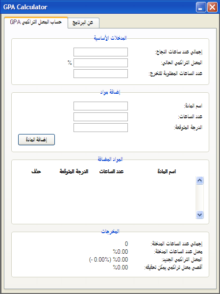
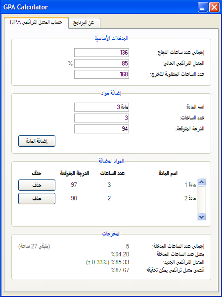
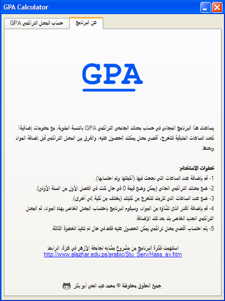

# GPA Calculator
احسب معدلك التراكمي في الجامعة.
  

  
 يساعدك هذا البرنامج المجاني في حساب معدلك الجامعي التراكمي GPA بالنسبة المئوية، مع معلومات إضافية؛ كعدد الساعات المتبقية للتخرج، أقصى معدل يمكنك الحصول عليه، والفرق بين المعدل التراكمي قبل إضافة المواد وبعدها.  
<b>خطوات الاستخدام:</b> 
1- قم بإضافة عدد الساعات التي نجحت فيها (أكملتها وتم احتسابها). 
2- ضع معدلك التراكمي الحالي (يمكن وضع قيمة 0 في حال كنت في الفصل الأول من السنة الأولى). 
3- ضع عدد الساعات التي تلزمك للتخرج من كليتك (يختلف من كلية إلى أخرى). 
4- قم بإضافة القدر الذي تشاؤه من المواد، وسيقوم البرنامج باحتساب المعدل الخاص بهذه المواد، ثم المعدل التراكمي الجديد الخاص بك بعد تلك الإضافة. 
5- يتم احتساب أقصى معدل تراكمي يمكن الحصول عليه فقط في حال تم تنفيذ الخطوة الثالثة.

 
:استلهمت فكرة البرنامج من مشروع مشابه لجامعة الأزهر في غزة، الرابط 
http://www.alazhar.edu.ps/arabic/Stu_Serv/Hass_av.htm
